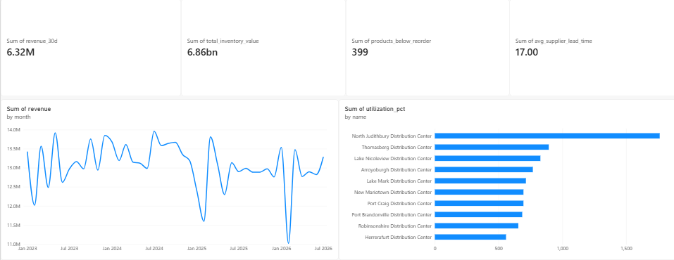
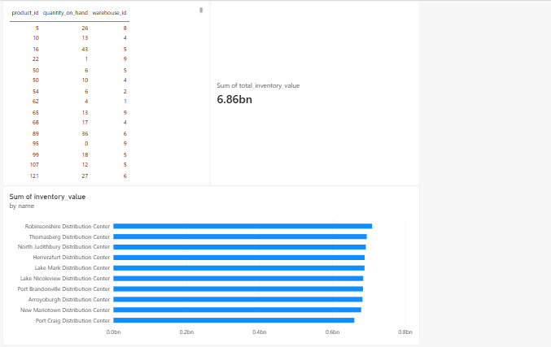
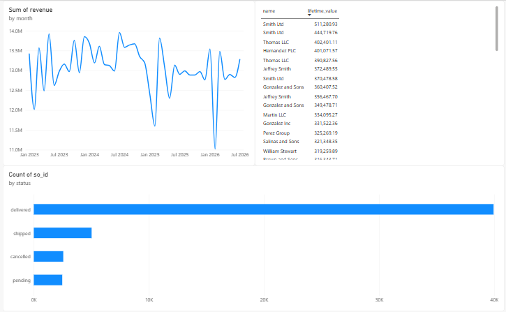
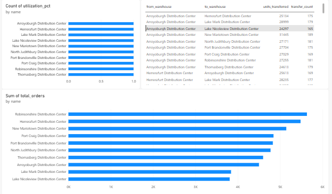

# Warehouse Analytica

Enterprise-grade PostgreSQL analytics platform for warehouse and supply-chain
intelligence, built with advanced SQL, query optimization, and BI reporting.

> Status: 🚧 In progress — Deliverables 1–9 complete (repo, schema, data pipeline,
> 50 analytics queries, views/matviews, procedures/triggers, performance engineering,
> Power BI dashboard). Remaining: FastAPI integration, documentation polish.

---

## Table of Contents

1. [Overview](#overview)
2. [Tech Stack](#tech-stack)
3. [Architecture](#architecture)
4. [Database Design](#database-design)
5. [Data Generation](#data-generation)
6. [Analytics Layer](#analytics-layer)
7. [Performance Engineering](#performance-engineering)
8. [Dashboard](#dashboard)
9. [API](#api)
10. [Getting Started](#getting-started)
11. [Repository Structure](#repository-structure)
12. [Interview Discussion Points](#interview-discussion-points

## Overview

A simulated warehouse and supply-chain operation — multiple warehouses buying from
suppliers, selling to customers, and tracking inventory movement between them —
built to demonstrate depth in relational database design, advanced SQL, and query
performance optimization, with a thin API and BI layer on top to show the data
in action end to end.

## Tech Stack

| Layer | Choice |
|---|---|
| Database | PostgreSQL 18 |
| DB tooling | pgAdmin 4 |
| Language | Python 3.14 |
| Data generation | Faker, Pandas, NumPy |
| DB driver | psycopg 3 |
| Config | python-dotenv |
| Analytics | Raw SQL, Views, Materialized Views, Window Functions, Recursive CTEs |
| Performance | EXPLAIN ANALYZE, Composite/Partial/Covering Indexes, Range Partitioning |
| Backend | FastAPI (minimal — exposes KPIs, refreshes materialized views) |
| Dashboard | Power BI Desktop |
| Docs | Markdown (diagrams described as text, hand-drawn in Excalidraw) |

## Architecture

<!-- TODO: fill in once finalized -->

## Database Design

The database is designed as a **normalized PostgreSQL relational database for warehouse and supply-chain operations**. The schema separates master data, transactional data, current inventory state, and historical inventory activity to maintain data integrity while supporting analytical workloads.

### Design Principles

The database design focuses on:

- Normalized relational structures
- Referential integrity through primary and foreign keys
- Database-level enforcement of business rules
- Separation of transactional and historical data
- Consistent inventory state management
- Efficient handling of high-volume inventory activity
- Support for complex analytical queries

### Schema Overview

The database consists of 13 core tables organized into the following functional areas:

| Area | Tables |
|---|---|
| Warehouse & Workforce | `warehouses`, `employees` |
| Product Management | `products`, `product_categories` |
| Supplier Management | `suppliers` |
| Customer Management | `customers` |
| Procurement | `purchase_orders`, `purchase_order_items` |
| Sales | `sales_orders`, `sales_order_items` |
| Inventory | `inventory`, `inventory_movements` |
| Warehouse Transfers | `stock_transfers` |

---

### Warehouse & Workforce

#### `warehouses`

Stores warehouse information including location and storage capacity.

Each warehouse can be associated with multiple:

- Employees
- Purchase orders
- Sales orders
- Inventory records
- Inventory movements

#### `employees`

Stores employees assigned to warehouses.

The `manager_id` column is a self-referencing foreign key that allows employee reporting relationships to be represented directly within the database.

```text
employees
    │
    └── manager_id → employees.employee_id
```

---

### Product Management

#### `product_categories`

Stores product categories and supports hierarchical categorization through `parent_category_id`.

For example:

```text
Electronics
├── Computers
│   ├── Laptops
│   └── Desktops
└── Accessories
    ├── Keyboards
    └── Mice
```

#### `products`

Stores the product master data.

Each product contains:

- Unique SKU
- Product name
- Category
- Supplier
- Unit selling price
- Unit cost
- Reorder level
- Reorder quantity

Products maintain foreign-key relationships with both `product_categories` and `suppliers`.

---

### Supplier Management

#### `suppliers`

Stores supplier information, contact details, country, and supplier rating.

A supplier can provide multiple products and can be associated with multiple purchase orders.

---

### Customer Management

#### `customers`

Stores customer information and customer segmentation.

Supported customer segments include:

```text
retail
wholesale
online
enterprise
```

Customers can place multiple sales orders.

---

### Procurement

Procurement is represented using separate order-header and order-line tables.

```text
purchase_orders
       │
       └── purchase_order_items
                    │
                    └── products
```

#### `purchase_orders`

Stores order-level information:

- Supplier
- Destination warehouse
- Responsible employee
- Order date
- Expected delivery date
- Actual delivery date
- Order status

#### `purchase_order_items`

Stores the individual products belonging to each purchase order.

Each line records:

- Product
- Quantity ordered
- Quantity received
- Unit cost

Separating order-level and item-level information avoids unnecessary duplication and allows each purchase order to contain multiple products.

---

### Sales

Sales follow the same header and line-item structure.

```text
customers
    │
    └── sales_orders
            │
            └── sales_order_items
                    │
                    └── products
```

#### `sales_orders`

Stores:

- Customer
- Warehouse
- Responsible employee
- Order date
- Ship date
- Order status

#### `sales_order_items`

Stores the products included in each sales order.

Each line records:

- Product
- Quantity
- Unit selling price
- Discount percentage

The selling price is stored at the order-line level so that historical transactions retain the price that was actually used at the time of sale, independent of subsequent changes to the product master price.

---

### Inventory Management

Inventory is represented using two complementary tables:

```text
                    INVENTORY
                  Current State
                       │
                       │
                       ▼
              INVENTORY MOVEMENTS
                 Event History
```

#### `inventory`

Stores the current inventory position for every product at every warehouse.

The following combination is unique:

```sql
(product_id, warehouse_id)
```

The table tracks:

- Quantity on hand
- Quantity reserved
- Last update timestamp

This provides efficient access to the current inventory position without having to reconstruct stock levels from the complete movement history.

Non-negative stock is enforced at two layers: a `CHECK` constraint at the schema level (`quantity_on_hand >= 0`), and a `BEFORE UPDATE` trigger (`trg_inventory_nonnegative`) providing an additional guard with a custom error message — defense in depth rather than relying on a single enforcement point.

#### `inventory_movements`

Stores the historical record of inventory activity.

Supported movement types:

```text
inbound
outbound
transfer_in
transfer_out
adjustment
```

Inventory movements can originate from:

- Purchase receipts
- Sales shipments
- Warehouse transfers
- Inventory adjustments

The table also stores a reference to the originating business transaction through `reference_id` and `reference_type`.

This is a **polymorphic association** — `reference_id` can point to a `purchase_order_items`, `sales_order_items`, or `stock_transfers` row depending on `reference_type`, rather than using three separate nullable foreign key columns. This trades strict referential integrity (the database cannot enforce that `reference_id` actually points to a valid row) for schema flexibility, since a single movements table needs to represent origins from three different source tables.

This provides an auditable history of inventory changes.

---

### Warehouse Transfers

#### `stock_transfers`

Represents movement of inventory between warehouses.

Each transfer records:

- Product
- Source warehouse
- Destination warehouse
- Responsible employee
- Quantity
- Transfer date
- Transfer status

The schema enforces that the source and destination warehouses cannot be the same:

```sql
CHECK (to_warehouse_id != from_warehouse_id)
```

Transfer lifecycle:

```text
pending
   ↓
in_transit
   ↓
completed
```

A transfer may also be cancelled before completion.

---

### Referential Integrity

Relationships between entities are enforced using foreign keys.

Examples include:

```text
products
 ├── category_id → product_categories
 └── supplier_id → suppliers

purchase_orders
 ├── supplier_id  → suppliers
 ├── warehouse_id → warehouses
 └── employee_id  → employees

sales_orders
 ├── customer_id  → customers
 ├── warehouse_id → warehouses
 └── employee_id  → employees

inventory
 ├── product_id   → products
 └── warehouse_id → warehouses
```

Order-item tables use `ON DELETE CASCADE` so that dependent line items are automatically removed when their corresponding order is deleted.

---

### Data Integrity Constraints

Business rules are enforced directly at the database level using `CHECK`, `UNIQUE`, `NOT NULL`, and foreign-key constraints.

Examples:

```sql
capacity_units > 0
quantity > 0
quantity_on_hand >= 0
quantity_reserved >= 0
discount_pct BETWEEN 0 AND 100
rating BETWEEN 0 AND 5
```

Status fields are also restricted to valid operational states.

This prevents invalid data from entering the system regardless of whether the operation originates from the API, scripts, or direct database access.

---

### Normalization

The schema follows normalized relational design principles, approximately **Third Normal Form (3NF)**.

Entity-specific information is stored in its appropriate table and referenced through keys rather than repeatedly duplicated across transactional records.

For example, supplier contact information is maintained in `suppliers` rather than being duplicated across every product or purchase order.

Likewise:

```text
purchase_orders
        │
        └── purchase_order_items
```

allows order-level attributes and product-level attributes to remain separate.

This reduces data redundancy and helps prevent update, insertion, and deletion anomalies.

---

### Transactional Operations

Operational changes to inventory are handled through PostgreSQL procedures and triggers.

Examples include:

- Receiving purchased inventory
- Transferring stock between warehouses
- Creating purchase orders
- Automatically reserving stock for sales
- Maintaining non-negative inventory
- Completing purchase orders when received

This keeps critical inventory rules close to the data and provides consistent behavior across different application entry points.

---

### Historical Inventory Data

`inventory_movements` is the primary historical activity table and is designed to handle significantly larger volumes than the master and transactional tables.

The table is **range-partitioned by `movement_date`** using monthly partitions.

```text
inventory_movements
        │
        ├── 2023-01
        ├── 2023-02
        ├── 2023-03
        ├── ...
        ├── 2026-08
        └── future
```

The current implementation contains **44 partitions covering January 2023 through August 2026, along with a future catch-all partition**.

Partitioning enables PostgreSQL to reduce the amount of historical data scanned for time-based inventory queries through partition pruning.

#### Primary Key Design for Partitioned Tables

`inventory_movements` uses a composite primary key:

```sql
PRIMARY KEY (movement_id, movement_date)
```

PostgreSQL requires the partition key to be included in any unique constraint (including the primary key) on a partitioned table. Since `movement_date` is the partition key, it must be part of the primary key alongside the auto-generated `movement_id`.

---

### Database Architecture

The resulting database separates the operational concerns into distinct layers of data:

```text
                    MASTER DATA
          ┌────────────────────────────┐
          │ Products                   │
          │ Categories                 │
          │ Suppliers                  │
          │ Customers                  │
          │ Warehouses                 │
          │ Employees                  │
          └─────────────┬──────────────┘
                        │
                        ▼
                 TRANSACTIONAL DATA
          ┌────────────────────────────┐
          │ Purchase Orders            │
          │ Purchase Order Items       │
          │ Sales Orders               │
          │ Sales Order Items          │
          │ Stock Transfers            │
          └─────────────┬──────────────┘
                        │
                        ▼
                  INVENTORY STATE
          ┌────────────────────────────┐
          │ Current Inventory          │
          └─────────────┬──────────────┘
                        │
                        ▼
                INVENTORY HISTORY
          ┌────────────────────────────┐
          │ Inventory Movements        │
          │ Monthly Partitioned        │
          └────────────────────────────┘
```

The normalized structure provides a consistent operational foundation, while the views, materialized views, analytical queries, indexes, and partitioning described in the subsequent sections build the analytics and performance layer on top of it.

## Data Generation

Synthetic data generated with Faker, seeded (`SEED=42`) for reproducibility:

| Entity | Count |
|---|---|
| Warehouses | 10 |
| Products | 5,000 |
| Suppliers | 100 |
| Employees | 300 |
| Customers | 2,000 |
| Purchase orders | 20,000 (→ 69,530 line items) |
| Sales orders | 50,000 (→ 150,096 line items) |
| Inventory movements | 222,312 (derived from real order/transfer activity, not independently randomized) |

## Analytics Layer

- **50 business SQL queries** across 9 categories: sales, inventory, warehouse,
  supplier, customer analysis, window functions, recursive CTEs, KPIs, and case
  studies.
- **10 views** — live reads over the OLTP tables (inventory status, dead stock,
  order revenue, customer LTV, supplier performance, warehouse utilization, etc.)
- **5 materialized views** — cached aggregations refreshed on demand via
  `sp_refresh_dashboard()` (monthly sales, inventory snapshot, supplier metrics,
  dashboard KPIs, warehouse summary)
- **4 stored procedures** — receive inventory, transfer stock, create purchase
  order, refresh dashboard
- **3 triggers** — inventory non-negative check, auto-reserve on sale, auto-complete
  purchase order

## Performance Engineering

- **Real monthly range partitioning** on `inventory_movements` (44 partitions,
  Jan 2023 – Aug 2026 + a future catch-all)
- **16 indexes** — composite, partial, covering, and FK-support
- **Before/after benchmarks** (EXPLAIN ANALYZE):

| Query | Before | After | Improvement |
|---|---|---|---|
| Dead stock detection | 94.234 ms | 21.980 ms | ~4.3× |
| Warehouse movements (30d) | 54.150 ms | 0.344 ms | ~157× |
| Customer LTV ranking | 306.441 ms | 202.124 ms | ~1.5× |

- **Partition pruning confirmed** — EXPLAIN plan shows only 1 of 44 partitions
  scanned for a date-range query

## Dashboard

A Power BI dashboard (`dashboard/warehouse_analytica.pbix`) built on top of the
materialized views and views layer, connected via native SQL queries (Import mode).

### Executive Overview
Top-level business health at a glance — 30-day revenue, total inventory value,
products below reorder, average supplier lead time, monthly revenue trend, and
warehouse utilization.



### Inventory Analytics
Products needing reorder, total inventory value, and inventory value by warehouse.



### Sales Analytics
Monthly revenue trend, top 20 customers by lifetime value, and order status
breakdown.



### Warehouse Analytics
Warehouse utilization, transfer volume between warehouse pairs, and total
orders processed per warehouse.



## API

Minimal FastAPI layer exposing analytics over the materialized views:

```
GET /dashboard/kpis
GET /inventory/current
GET /inventory/below-reorder
GET /analytics/products/top-selling
GET /analytics/warehouses/utilization
GET /analytics/suppliers/performance
POST /analytics/refresh-materialized-views
```

<!-- TODO: confirm final endpoint list once Deliverable 10 is complete -->

## Getting Started

```bash
# 1. Clone and configure
git clone <repo-url>
cd warehouse-analytics
copy .env.example .env   # edit credentials as needed

# 2. Install PostgreSQL 18 and create the database

# 3. Set up Python environment
python -m venv .venv
.venv\Scripts\activate
pip install -r requirements.txt

# 4. Generate synthetic data
cd data-generator
python generate_all.py
cd ..

# 5. Load data into PostgreSQL
python scripts/load_database.py
python scripts/derive_movements.py

# 6. Apply schema, indexes, and partitioning
psql -U warehouse_admin -d warehouse_analytics -f sql/ddl/01_schema.sql
psql -U warehouse_admin -d warehouse_analytics -f sql/ddl/04_partitioning.sql
psql -U warehouse_admin -d warehouse_analytics -f sql/ddl/03_indexes.sql

# 7. Create views, materialized views, procedures, and triggers
psql -U warehouse_admin -d warehouse_analytics -f sql/views/inventory_views.sql
# ... (repeat for remaining view/procedure/trigger files)

# 8. Run the API
uvicorn backend.app:app --reload
```

## Repository Structure

```
warehouse-analytics/
├── README.md
├── LICENSE
├── .gitignore
├── .gitattributes
├── requirements.txt
├── .env.example
├── docs/
├── sql/
│ ├── ddl/ # schema, indexes, partitioning
│ ├── views/
│ ├── materialized_views/
│ ├── procedures/
│ ├── triggers/
│ └── analytics/ # the 50 business queries, split by category
├── data-generator/
│ ├── config.py
│ ├── generate_all.py
│ ├── generators/
│ └── utils/
├── backend/
│ ├── app.py
│ ├── database.py
│ └── routers/
├── dashboard/
├── scripts/ # load_database, derive_movements, benchmark
└── tests/
```
